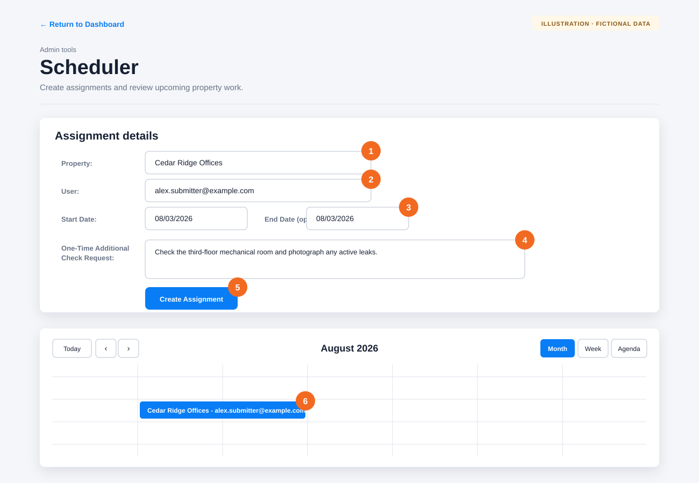

# Create and manage a scheduler assignment

**Audience:** Organization administrators and property managers

**Current access:** Administrators across their organization; property managers for properties assigned to them

Use Scheduler to assign property work to an eligible organization user or deployed Afterlight resource, set the work dates, and include instructions shown with the assignment.

## Create an assignment

From the Dashboard navigation, open **Scheduler**, then use the numbered areas in the illustration:

1. Choose the **Property**.
2. Confirm the **Fulfillment** source. Choose **Afterlight contractor** when assigning a deployed Afterlight resource.
3. Choose the **User** who will complete the work. The list updates for the selected property and fulfillment source.
4. Set the **Start Date** and **End Date**. Avoid dates that overlap another assignment for the same property.
5. In **One-Time Additional Check Request**, enter only instructions for this assignment. Be concise and do not place passwords, alarm codes, or other secrets here.
6. Select **Create Assignment**.
7. Confirm that the new assignment appears on the calendar.

Afterlight adds the assignment to the calendar and sends an in-app or push notification when available. Organization users see the work on their Dashboard. Afterlight resources see it in the Resource Portal with the snapshotted assignment compensation.

Some organizations also display an **Event Type** field with options such as **QA Check**, **Maintenance**, and **Cleaning**. Choose the type that matches the work before selecting the user.

## Change or delete an assignment

1. Select the assignment in the calendar. The form is populated with its current values.
2. Change the property, user, dates, or instructions and select **Update Assignment**.
3. To remove it instead, select **Delete Assignment** and confirm the prompt.

You can also drag an assignment to new dates in the calendar. Open it afterward to verify the start and end dates.

## If something goes wrong

- **The user is missing:** Only active, eligible users in the organization appear. Check the user’s account and role.
- **An Afterlight contractor is missing:** Confirm that **Afterlight contractor** is the selected fulfillment source and that the resource has an active deployment for the selected property and date.
- **The assignment overlaps:** Choose different dates or edit the existing assignment for that property.
- **The assignment is created but the user did not receive a push:** Ask them to sign in and check **My Assignments** or the Resource Portal.
- **A property manager cannot select the property:** An organization administrator must assign that property to the manager before they can schedule its work.
- **A completed assignment cannot be edited or deleted:** This protects the inspection and any contractor earning created from it.

[Back to the knowledge base](README.md)
