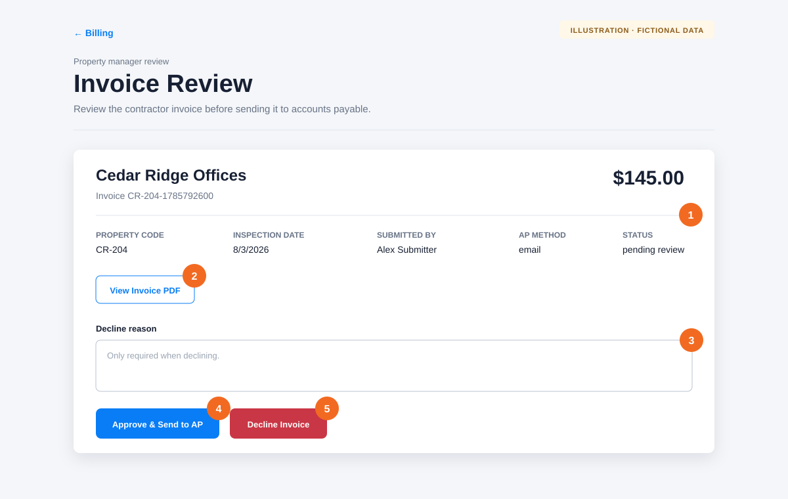

# Review, approve, or decline an invoice

**Audience:** Property managers

**Applies to:** Invoices for properties assigned to you

Use the invoice review to confirm the PDF and either approve delivery to accounts payable or return the invoice with a clear reason. An **Afterlight service** invoice is prepared by Afterlight platform billing; its submitter field identifies who performed the inspection, not who owns the invoice.

## Open the review

Open the **Review Invoice** link in the notification email, or open **Billing** and find an invoice with the **Awaiting PM Review** status. Property managers see only invoices for properties assigned to them.

## Review and decide

1. Confirm the property, invoice number, amount, property code, inspection date, submitter, and AP method.
2. Select **View Invoice PDF** and check the complete invoice before deciding.
3. If you plan to return the invoice, enter a specific **Decline reason**. The reason is required and is shown to the submitter.
4. To approve it, select **Approve & Send to AP**. Select it only once and wait for the success message.
5. To return it, select **Decline Invoice**.

A useful decline reason identifies both the problem and the expected correction. For example: “Amount should be $145.00 per the current inspection rate. Please update the amount and resubmit.”

## What happens after approval

- The invoice moves to **Sent to AP** after successful delivery processing.
- For an email AP method, Afterlight emails the approved PDF to the configured AP address.
- For a manual-download or portal AP method, follow your organization’s AP procedure after approval.
- If delivery fails, the status changes to **AP Delivery Failed**. Open Billing and select **Retry AP Delivery** after the configuration or delivery problem is corrected.

## What happens after a decline

The invoice moves to **Needs Revision**. For customer-contractor invoices, Afterlight notifies the submitter and displays your decline reason in their Billing view. For Afterlight service invoices, the reason returns to **Platform > Service Billing** for Afterlight to correct, regenerate, and resubmit.

## If something goes wrong

- **The link asks you to sign in:** Sign in with the property-manager account named in the request. Afterlight returns you to the review when the session is active.
- **“Your role cannot review this invoice”:** Confirm that the property is assigned to your property-manager account.
- **The invoice is no longer awaiting approval:** Another reviewer may already have acted. Return to Billing and refresh the list.
- **Approval reports an AP configuration error:** Ask an organization administrator to correct the property’s AP destination, then use **Retry AP Delivery**.

[Back to the knowledge base](README.md)
