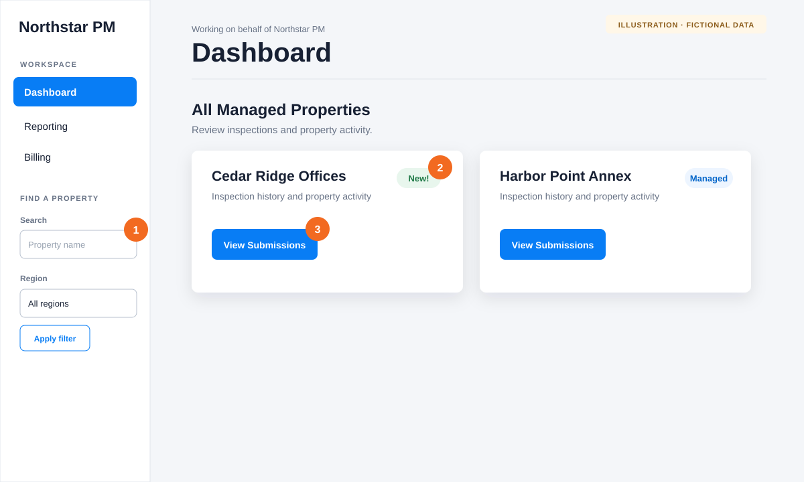
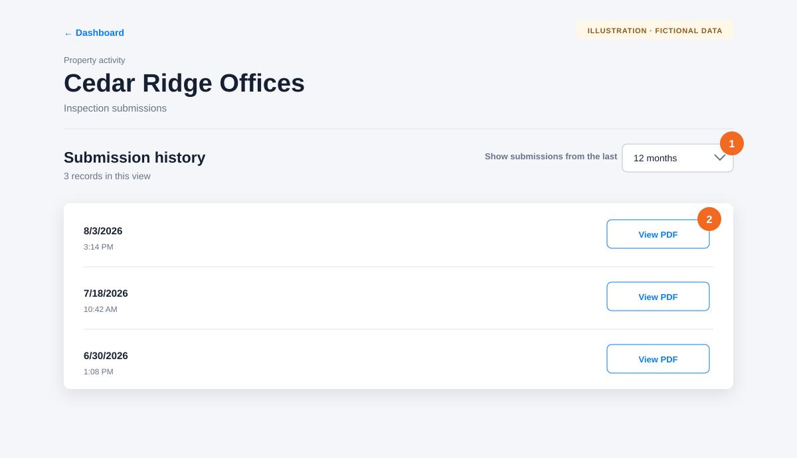

# Review inspection submissions for a property

**Audience:** Property managers and organization administrators

Use a property’s submission history to open completed inspection reports. Property managers see only their managed properties.

## Open a property’s history

1. Open **Dashboard**.
2. Find the property under **All Managed Properties**. A **New!** badge means the property has unread inspection activity.
3. Select **View Submissions**.

You can use **Search** and **Region** in the navigation to narrow a long property list.

## Filter the history

Use one or more filters to narrow the property history:

- **Date range:** Choose the last 1, 3, 6, 12, or 18 months.
- **Submitted by:** Show work completed by one person.
- **Assigned by:** Show work scheduled by one person. Choose **Not recorded / direct** for direct submissions and older records without assignment details.
- **Fulfillment:** Show direct submissions, customer employees or contractors, Afterlight staff or contractors, or legacy assignments when those values exist in the selected history.

Filters query every matching submission in the selected property and date range before the page is selected. They are not limited to records already visible on the current page. Changing a filter returns you to page 1. Select **Clear filters** to return to the default 12-month view.

## Open a report

Each result shows the submission date and time, **Submitted by**, **Date assigned**, **Assigned by**, and **Fulfillment**. Older or direct submissions may show **Not recorded** when no linked assignment exists.

1. Find the submission using its date and assignment details.
2. Select **View PDF**. The report opens in a new browser tab.

Afterlight displays 10 records per page. When more than 10 records match, use **Previous** and **Next** below the results. The page summary shows the visible record range, total matching records, and current page.

The property’s new-activity notification is marked read when you open its submission history.

For trends across multiple submissions, return to the Dashboard and open **Reporting**. You can filter Reporting by date range, property, and submitter.

## If something goes wrong

- **No submissions are shown:** Increase the date range, clear one or more filters, and confirm that you opened the correct property.
- **A recent inspection is missing:** Its report may still be processing. Wait a few minutes, then refresh the page.
- **Assignment details say Not recorded:** The inspection may have been submitted directly or may predate assignment-history linking. The completed report remains valid.
- **View PDF does not open:** Allow pop-ups for Afterlight or open the link in a new tab.
- **The property is missing from your Dashboard:** Ask an organization administrator to verify that you are assigned as a property manager for that property.

[Back to the knowledge base](README.md)
