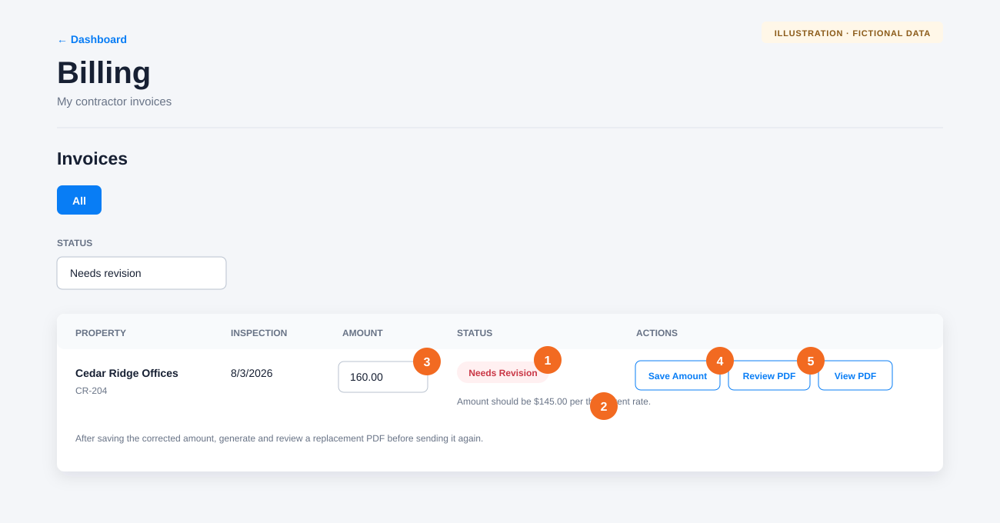

# Revise and resubmit a declined invoice

**Audience:** Submitters

**Applies to:** Commercial property invoices with a **Needs Revision** status

When a property manager declines an invoice, Afterlight returns it to you and displays their reason in Billing. Correct the amount, generate a new PDF, and send the invoice back for review.

## Revise the invoice

1. Open **Billing** and find the invoice marked **Needs Revision**. You can choose **Needs revision** in the Status filter.
2. Read the property manager’s reason below the status before making changes.
3. Enter the corrected amount.
4. Select **Save Amount**. Saving returns the invoice to **Draft** and clears the old PDF and review decision.
5. Select **Review PDF** to generate a replacement invoice.

Review the replacement PDF, then select **Send for Approval**.

The invoice returns to **Awaiting PM Review**, and the assigned property manager receives a new review notification.

## Important limitations

The Billing screen lets a submitter revise the invoice amount. Property details, billing instructions, and inspection information come from the property and completed inspection records. If the decline reason concerns one of those items, contact an organization administrator before generating the replacement PDF.

## If something goes wrong

- **The decline reason is unclear:** Ask the property manager what needs to change before resubmitting.
- **The amount will not save:** Enter a positive number without a currency symbol.
- **The old PDF still opens:** Confirm that **Save Amount** finished, then select **Review PDF** to generate the replacement.
- **The status is no longer Needs Revision:** Refresh Billing. Another action may already have changed the invoice.

[Back to the knowledge base](README.md)
