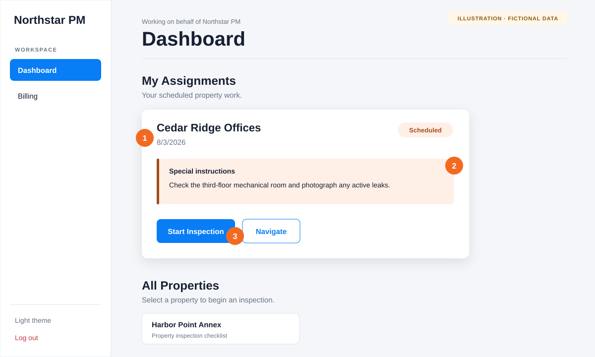
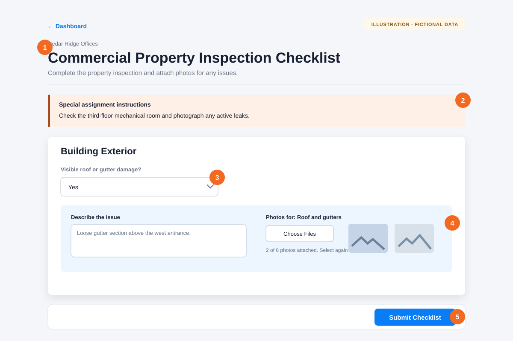

# Complete and submit an inspection

**Audience:** Submitters, contractors, and cleaners

**Applies to:** Commercial, residential, long-term rental, and short-term rental inspections

Use this workflow when an inspection has been assigned to you or when you need to inspect a property shown on your Dashboard.

## Before you begin

- Confirm that you are signed into the correct organization.
- Allow camera or photo-library access if you plan to attach photos.
- For an assigned inspection, read the date and any special instructions before you start.
- Stay on a reliable connection until the app confirms that the inspection was received.

## 1. Open the inspection

1. Find the property in **My Assignments**. A scheduled assignment shows the property name and date.
2. Read **Special instructions** before beginning the work.
3. Select **Start Inspection**. Use **Navigate** first if directions are available and you still need to travel to the property.

If the property is not in **My Assignments**, find it under **All Properties** and select **Start Inspection** there.

For some short-term rental properties, Afterlight first displays **Select an Action**. Choose **Access / Info** to review entry details, then return and choose **Submit Form** to open the checklist.

## 2. Complete the checklist

1. Confirm the property name at the top of the checklist.
2. Review any **Special assignment instructions**, then complete every required field. Your organization controls the checklist questions, so the fields may differ from the example.
3. When a response opens a follow-up area, describe the issue clearly. Include the location, what you observed, and any immediate action taken.
4. Attach clear, relevant photos when requested. You can attach up to six photos to each photo field and select files again to add more.
5. Review the form, then select **Submit Checklist** once. The button is disabled while the app uploads photos and prepares the report.

## 3. Wait for confirmation

Progress messages may say **Preparing secure photo uploads**, **Uploading photo**, **Photos uploaded**, or **Generating your inspection report**. Do not repeatedly select the submit button or close the page during the upload.

The inspection is received when the page displays **Inspection complete**. Select **Return to Dashboard**.

For commercial properties, a new invoice is created automatically after the inspection report finishes processing. Continue with [Prepare and send an invoice for approval](submitter-submit-invoice.md).

## If something goes wrong

- **A required field is highlighted:** Complete that field and submit again.
- **A question asks for details or a photo:** Add the requested follow-up information. Some issue responses cannot be submitted without both.
- **The upload stops:** Keep the page open, check your connection, and retry when the app displays an error.
- **The property is missing:** Ask an organization administrator to confirm the property and assignment.
- **You submitted the wrong information:** Contact the property manager or administrator. A completed inspection cannot be edited from the Dashboard.

[Back to the knowledge base](README.md)
