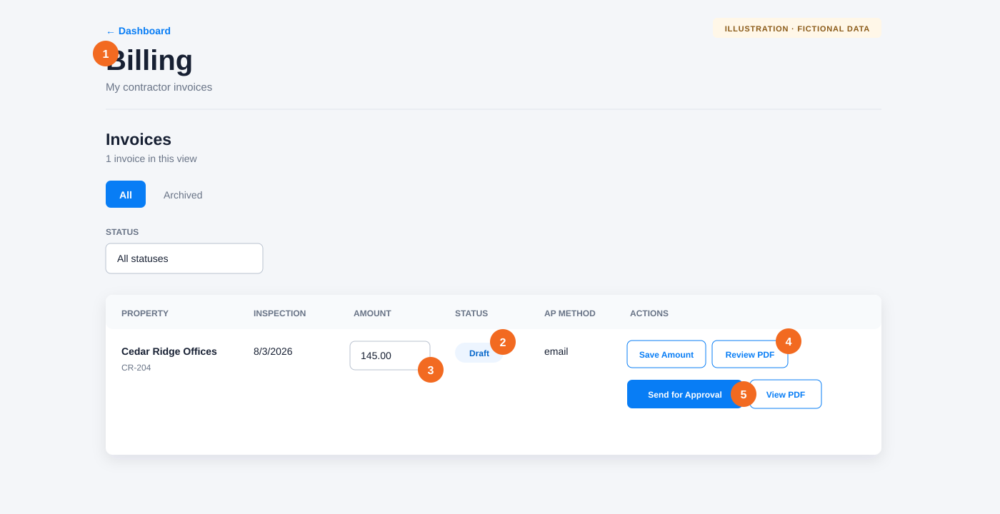

# Prepare and send an invoice for approval

**Audience:** Submitters

**Applies to:** Commercial property inspections

After a commercial inspection report finishes processing, Afterlight automatically creates a **Draft** invoice in Billing. Use this workflow to verify its amount, review the generated PDF, and send it to the assigned property manager.

## Before you begin

- Complete and submit the commercial inspection.
- Wait for its report to finish processing.
- Ask an administrator for help if the property has no billing code or no active property manager; both are required before the invoice can be sent for approval.

## Prepare the invoice

1. Open **Billing** from the workspace navigation.
2. In the **All** view, find the invoice with a **Draft** status. Use the **Status** filter if the list is long.
3. Verify the property and inspection date. Enter or confirm the **Amount**, then select **Save Amount**.
4. Select **Review PDF**. Afterlight generates the invoice PDF and opens it for review.
5. Check the property name, property code, inspection date, amount, and billing address in the PDF. Close the preview to return to Billing.
6. Select **Send for Approval**. This button appears only after the PDF has been generated.

## What happens next

The invoice status changes to **Awaiting PM Review**. Afterlight notifies the active property manager assigned to that property and attempts to email the review request.

You cannot change the invoice while it is awaiting review. The status changes to **Sent to AP** if the property manager approves it, or **Needs Revision** if they return it.

## If something goes wrong

- **Review PDF is available, but Send for Approval is missing:** Finish generating the PDF and wait for the Billing row to refresh.
- **“Set an amount before generating the invoice”:** Enter a positive amount and select **Save Amount** first.
- **“An admin must configure the property's billing code first”:** Ask an organization administrator to update the property’s Billing settings.
- **“An active property manager must be assigned”:** Ask an organization administrator to assign an active property manager to the property.
- **The invoice is not listed:** Confirm that you are viewing **All**, clear the Status filter, and make sure the inspection report completed.

[Back to the knowledge base](README.md)
